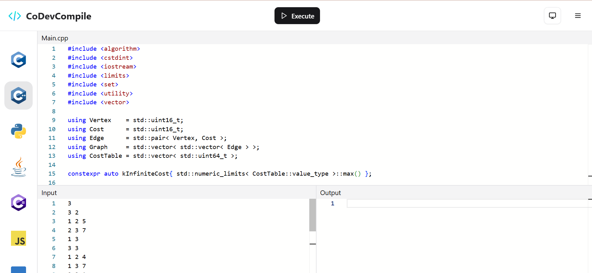

# **🖥 CoDevCompile - Online Code Compiler**

A web-based code compiler that supports multiple programming languages, built using **Next.js, TypeScript, ShadCN, and Monaco Editor**.  
***Write, compile, and execute code in multiple languages, all from your browser!***

---

## **✨ Features**
1. **Multi-Language Support** – Compile C, C++, JavaScript, Python, and more!  
2. **Real-time Code Execution** – Execute code instantly with API-powered execution.
3. **Dark/Light Mode** – Theme toggling using ShadCN.
4. **Monaco Editor** – A powerful code editor with syntax highlighting & autocomplete.
5. **Code Templates** – Auto-loads default "Hello, World!" programs for different languages.
6. **Mobile-Friendly** – Fully responsive UI for different screen sizes.  

---

## **⚙️ Tech Stack**
- **Frontend:** Next.js, TypeScript, Tailwind CSS, ShadCN, Monaco Editor  
- **Backend:** Next.js API Routes
- **Deployement:** Vercel
- **Code Execution API:** [Piston API](https://github.com/engineer-man/piston)  

---

## **🚀 Getting Started**
### **1️⃣ Clone the Repository**
```bash
git clone https://github.com/DevFreAkeD/CoDevCompile-2.0.git
cd CoDevCompile-2.0
```

### **2️⃣ Install Dependencies**
```bash
npm install
# or
yarn install
```

### **3️⃣ Run the Development Server**
```bash
npm run dev
# or
yarn dev
```
Now open [http://localhost:3000](http://localhost:3000) in your browser. 🎉  

---

## **🔧 API Endpoints**
### **Compile Code**
```http
POST /api/compile
```
**Request Body (JSON)**
```json
{
  "code": "#include <stdio.h>\nint main() { printf(\"Hello, World!\"); return 0; }",
  "language": "c",
  "input": ""
}
```
**Response**
```json
{
  "stdout": "Hello, World!",
  "stderr": "",
  "code": 0,
  "signal": null,
  "output": "Hello, World!"
}
```

---

## **🎨 UI Components**
- **Header:** Contains the "Execute" button and dark mode toggle.  
- **Sidebar:** Allows selecting different languages.  
- **Code Editor:** Monaco Editor with syntax highlighting.  
- **Input/Output Panels:** Displays input fields and execution results.  

---

## **🖥 Live Link**
Checkout the website [link](https://codevcompile.vercel.app)

---
## Demo(Screenshot)

